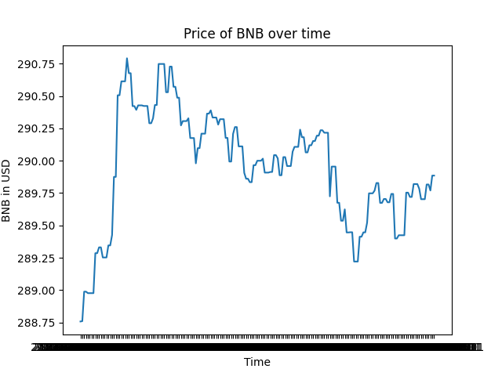
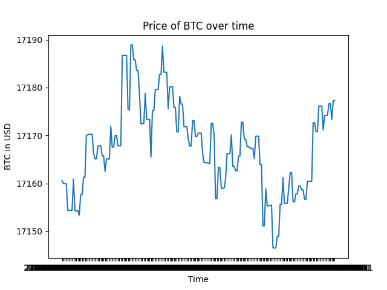
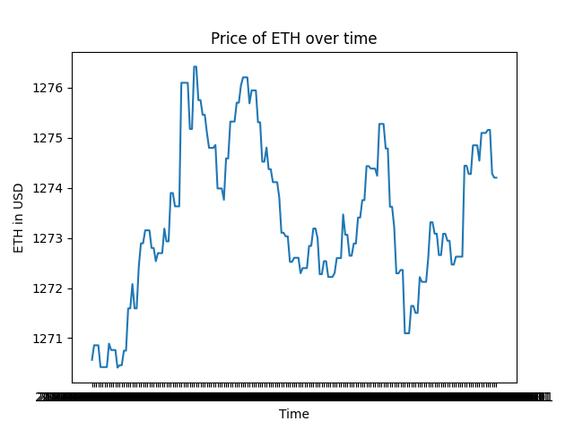
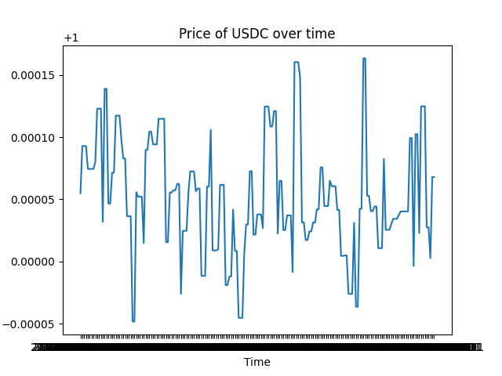
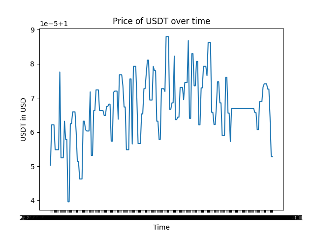

# Reporting on cryptocurrency data. ma 12 dec 2022 00:01:55 CET

## BNB

## BTC

## ETH

## USDC

## USDT

## Conclusion

BNB		mean=289.95513916015625,standard deviation=0.43673720955848694
BTC		mean=17167.544921875,standard deviation=9.280871391296387
ETH		mean=1273.39697265625,standard deviation=1.5341639518737793
USDC		mean=1.0000522136688232,standard deviation=4.6000284783076495e-05
USDT		mean=1.0000672340393066,standard deviation=9.09070331545081e-06
